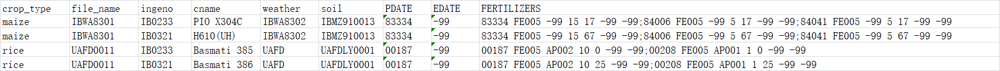

# Pydssat
Pydssat es un proyecto realizado en python para ejecutar simulaciones, como bien crear/modificar importantes archivos para el modelo de simulacion de cultivos DSSAT

__PAY ATTENTION__:This project works on ___WIN OS___ only with ___PYTHON3.6___.

## Estructura
Este proyecto consta de utils, dssat y run_model.
### utils.py
utils.py le ayuda a __BATCH__ crear archivos .cuX con un formato específico de archivo xlsx de entrada.
Puede deberse con diferentes __tipo de cultivo__ y diferente __nivel de fertilizante__
_ (Hasta ahora solo he hecho esta parte, cualquiera que sea, las declaraciones de comando son muy similares)
### dssat.py
dssat.py contiene la clase DSSAT que ayuda a ejecutar el modelo glue y dssat con un solo archivo .X
### run_model.py
run_model.py makes us easier to use this project with command line.
In this file, I set some default arguments for convenient._(If needed ,please change it manually ,I am a lazy guy...😀)_

## Usage
### Input xlsx file
The only thing that we need to concern about is formatted xlsx file.

### A SIMPLE WAY:
```
python run_model.py -i \PATH\TO\INPUT.xlsx -e 5000
```
More arguments: python run_model.py --help
### SOME FLEXIBLE WAYS:
You can call the functions in this project whose keyword params are set for more flexible usage.
Keep in mind that _input.xlsx->input.json->x.files:foreach x in x,files->dssat.
